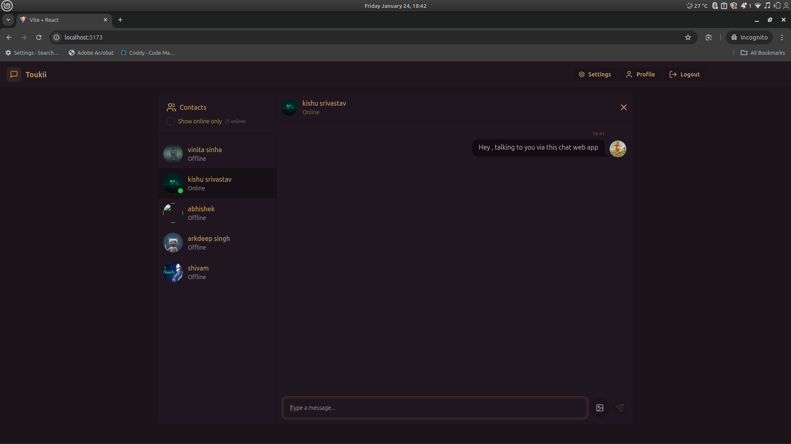

# Chat App

A simple chat application built with Node.js, Express, and Socket.IO, allowing users to connect and communicate in real-time.

## Preview

<p align="center">
  
  
  
  
</p>

## Features

- **User Authentication**: Secure authentication using `bcryptjs` and `jsonwebtoken`.
- **Real-time Communication**: Powered by `socket.io` for seamless chat experiences.
- **Cloudinary Integration**: Handle image uploads efficiently.
- **Environment Configuration**: Manage sensitive data securely with `dotenv`.
- **Cookie Management**: Easy cookie parsing using `cookie-parser`.
- **Database Integration**: Uses `mongoose` to connect to MongoDB for data persistence.

## Installation

1. Clone the repository:
   ```bash
   git clone https://github.com/kishlay-kumar7/chat-app.git
   ```
